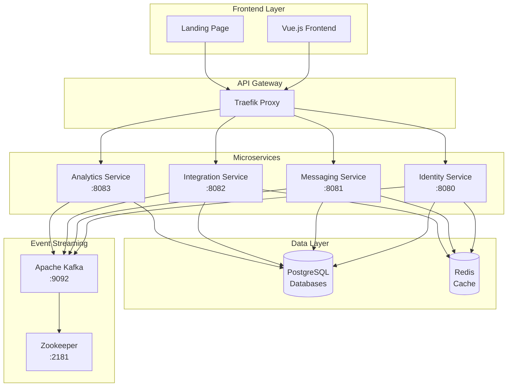

<div align="center">


<br/>

<p>
<strong>Meridian</strong> is a modern, real-time communication platform built with Domain Driven Design (DDD) microservices architecture. Experience a seamless chat with enterprise-grade security, real-time messaging, and powerful integration capabilities.
</p>

<p>
  <a href="#quick-start">
    
  </a>
  <a href="docs/">
    
  </a>
  <a href="#license">
    
  </a>
</p>

<p>
  
  
  
  
  
</p>

</div>

---

## 🌟 Features

<table>
  <tr>
    <td width="50%">
      <h3>🚀 Real-time Messaging</h3>
      <ul>
        <li>WebSocket-powered instant messaging</li>
        <li>Channel-based communication</li>
        <li>Message threading and reactions</li>
        <li>Typing indicators and presence</li>
      </ul>
    </td>
    <td width="50%">
      <h3>🔐 Enterprise Security</h3>
      <ul>
        <li>PASETO token authentication</li>
        <li>Role-based access control</li>
        <li>Secure API token management</li>
        <li>Encrypted data transmission</li>
      </ul>
    </td>
  </tr>
  <tr>
    <td width="50%">
      <h3>🤖 Bot & Webhook Integration</h3>
      <ul>
        <li>REST API and gRPC interfaces</li>
        <li>Custom webhook endpoints</li>
        <li>Third-party platform bridges</li>
      </ul>
    </td>
    <td width="50%">
      <h3>📊 Analytics & Insights</h3>
      <ul>
        <li>Real-time usage analytics</li>
        <li>User engagement metrics</li>
        <li>Channel activity tracking</li>
        <li>Custom dashboard views</li>
      </ul>
    </td>
  </tr>
</table>

## 🏗️ Architecture

Meridian follows **Domain Driven Design** principles with a clean microservices architecture:

<div align="center">



</div>

### 🎯 Core Services

| Service                                         | Port    | Purpose                          | Technology                          |
| ----------------------------------------------- | ------- | -------------------------------- | ----------------------------------- |
| **[Identity](docs/services/identity.md)**       | `:8080` | User authentication & management | Go + PostgreSQL + Redis             |
| **[Messaging](docs/services/messaging.md)**     | `:8081` | Real-time chat & channels        | Go + PostgreSQL + Redis + WebSocket |
| **[Integration](docs/services/integration.md)** | `:8082` | Webhooks & bot integrations      | Go + PostgreSQL + Redis             |
| **[Analytics](docs/services/analytics.md)**     | `:8083` | Usage analytics & insights       | Go + PostgreSQL + Kafka             |

## 🚀 Quick Start

### Prerequisites

- **Docker** & **Docker Compose** v2+
- **Go** 1.24+ (for development)
- **8GB+ RAM** recommended

### Quick Setup

```bash
# Clone the repository
git clone https://github.com/your-org/meridian.git
cd meridian

# Setup environment and start services
make setup
make docker-build
make docker-up
```

**Note**: Go is required for initial setup as you need to run the script to generate PASETO Asymmetric keys, if you just want to purely run it with docker, altough not recommended, here are placeholder Paseto Keys:

```bash
#PRIVATE KEY (64 bytes / 128 hex chars):
de62c9983573159bc401db26eaad66f57f58127dfa74b409fc47721cf1c37d41acd1c1d9208c09f6990d84d19bfbee24e9f26ed8613819aa9ecbcf082cf24919

#PUBLIC KEY (32 bytes / 64 hex chars):
acd1c1d9208c09f6990d84d19bfbee24e9f26ed8613819aa9ecbcf082cf24919
```

Replace the keys in your `deployments/.env` file.

### Verify Installation

```bash
# Check service health
curl http://localhost:8080/health  # ✅ Identity Service
curl http://localhost:8081/health  # ✅ Messaging Service
curl http://localhost:8082/health  # ✅ Integration Service
curl http://localhost:8083/health  # ✅ Analytics Service
```

### Access the Platform

- **Frontend Application**: http://localhost:3000
- **Landing Page**: http://localhost:3001
- **API Documentation**: [docs/api/](docs/api/)

## 📖 Documentation

The comprehensive documentation covers everything you need:

<div align="center">

|   📚 **Category**    | 🔗 **Links**                                                                                  | 📝 **Description**                  |
| :------------------: | :-------------------------------------------------------------------------------------------- | :---------------------------------- |
| **🏗️ Architecture**  | [Overview](docs/architecture/overview.md) • [Domain Model](docs/architecture/domain-model.md) | System design and DDD patterns      |
| **📡 API Reference** | [REST](docs/api/rest-api.md)                                                                  | Complete API documentation          |
|  **🚢 Deployment**   | [Docker](docs/deployment/docker.md)                                                           | Deployment guide and best practices |

</div>

## 🛠️ Development

### Development Commands

```bash
# Setup and deployment
make setup                  # Generate keys and env file
make docker-build                  # Build all service binaries
make docker-up              # Start all services
make docker-down            # Stop and remove containers

# Development workflow
make test                   # Run tests
make lint                   # Run linters
make fmt                    # Format code
make tidy                   # Tidy Go modules

# Database operations
make migrate-up service=<name>    # Apply migrations
make migrate-down service=<name>  # Rollback migrations
make migrate-status service=<name> # Check migration status

# Service-specific operations
make build-one service=<name>     # Build specific service
make docker-logs service=<name>   # View service logs
```

### Project Structure

```
meridian/
├── cmd/                    # Service entry points
│   ├── identity/           # Identity service main
│   ├── messaging/          # Messaging service main
│   ├── integration/        # Integration service main
│   └── analytics/          # Analytics service main
├── internal/               # Service implementations
│   ├── identity/          # Identity domain, app, infra
│   ├── messaging/         # Messaging domain, app, infra
│   ├── integration/       # Integration domain, app,
├── pkg/                   # Shared libraries
│   ├── auth/              # Authentication utilities
│   ├── kafka/             # Event streaming
│   ├── logging/           # Structured logging
│   └── cache/             # Caching utilities
├── deployments/           # Docker and deployment configs
├── docs/                  # Documentation
└── examples/              # Integration examples (TODO)
```

## 🤝 Contributing

We welcome contributions! Please see our [Contributing Guide](docs/contributing/) for details.

### Code Quality

- **Domain Driven Design** principles
- **Clean Architecture** with clear boundaries
- **Structured logging** throughout

## 📄 License

This project is licensed under the **MIT License** - see the [LICENSE](LICENSE) file for details.

---

<div align="center">

**Built with ❤️ by the Sebastijan Zindl**

⭐ **Star us on GitHub** if you find this project interesting!

[📖 Documentation](docs/) • [🐛 Report Bug](https://github.com/m1thrandir225/meridian/issues) • [💡 Request Feature](https://github.com/m1thrandir225/meridian/issues/new?template=feature_request.md)

</div>
