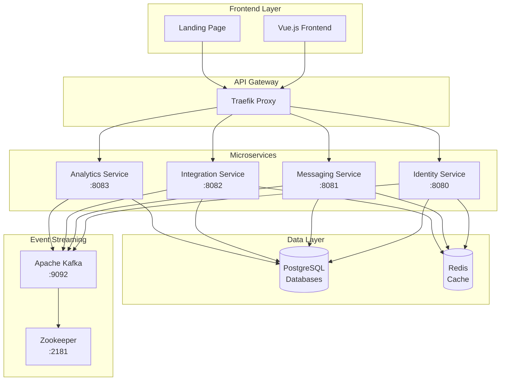

<div align="center">


<h1>Meridian</h1>

<p>
<strong>Meridian</strong> is a modern, real-time communication platform built with Domain Driven Design (DDD) microservices architecture. Experience a seamless chat with enterprise-grade security, real-time messaging, and powerful integration capabilities.
</p>

<p>
  <a href="#quick-start">
    
  </a>
  <a href="docs/">
    
  </a>
  <a href="#license">
    
  </a>
</p>

<p>
  
  
  
  
  
</p>

</div>

---

## 🌟 Features

<table>
  <tr>
    <td width="50%">
      <h3>🚀 Real-time Messaging</h3>
      <ul>
        <li>WebSocket-powered instant messaging</li>
        <li>Channel-based communication</li>
        <li>Message threading and reactions</li>
        <li>Typing indicators and presence</li>
      </ul>
    </td>
    <td width="50%">
      <h3>🔐 Enterprise Security</h3>
      <ul>
        <li>PASETO token authentication</li>
        <li>Role-based access control</li>
        <li>Secure API token management</li>
        <li>Encrypted data transmission</li>
      </ul>
    </td>
  </tr>
  <tr>
    <td width="50%">
      <h3>🤖 Bot & Webhook Integration</h3>
      <ul>
        <li>REST API and gRPC interfaces</li>
        <li>Custom webhook endpoints</li>
        <li>Third-party platform bridges</li>
      </ul>
    </td>
    <td width="50%">
      <h3>📊 Analytics & Insights</h3>
      <ul>
        <li>Real-time usage analytics</li>
        <li>User engagement metrics</li>
        <li>Channel activity tracking</li>
        <li>Custom dashboard views</li>
      </ul>
    </td>
  </tr>
</table>

## 🏗️ Architecture

Meridian follows **Domain Driven Design** principles with a clean microservices architecture:

<div align="center">



</div>

### 🎯 Core Services

| Service                                         | Port    | Purpose                          | Technology                          |
| ----------------------------------------------- | ------- | -------------------------------- | ----------------------------------- |
| **[Identity](docs/services/identity.md)**       | `:8080` | User authentication & management | Go + PostgreSQL + Redis             |
| **[Messaging](docs/services/messaging.md)**     | `:8081` | Real-time chat & channels        | Go + PostgreSQL + Redis + WebSocket |
| **[Integration](docs/services/integration.md)** | `:8082` | Webhooks & bot integrations      | Go + PostgreSQL + Redis             |
| **[Analytics](docs/services/analytics.md)**     | `:8083` | Usage analytics & insights       | Go + PostgreSQL + Kafka             |

## 🚀 Quick Start

### Prerequisites

- **Docker** & **Docker Compose** v2+
- **Go** 1.24+ (for development)
- **8GB+ RAM** recommended

### One-Command Setup

```bash
# Clone and start Meridian
git clone https://github.com/your-org/meridian.git
cd meridian
make docker-env && make docker-build && make docker-up
```

### Verify Installation

```bash
# Check service health
curl http://localhost:8080/health  # ✅ Identity Service
curl http://localhost:8081/health  # ✅ Messaging Service
curl http://localhost:8082/health  # ✅ Integration Service
curl http://localhost:8083/health  # ✅ Analytics Service
```

### Create Your First User

```bash
curl -X POST http://localhost:8080/api/v1/auth/register \
  -H "Content-Type: application/json" \
  -d '{
    "username": "admin",
    "email": "admin@example.com",
    "first_name": "Admin",
    "last_name": "User",
    "password": "password123"
  }'
```

### Access the Platform

- **Frontend Application**: http://chat.localhost
- **Landing Page**: http://localhost
- **Traefik Dashboard**: http://localhost:8080
- **API Documentation**: [docs/api/](docs/api/)

## 📖 Documentation

The comprehensive documentation covers everything you need:

<div align="center">

|    📚 **Category**     | 🔗 **Links**                                                                                                                    | 📝 **Description**                        |
| :--------------------: | :------------------------------------------------------------------------------------------------------------------------------ | :---------------------------------------- |
| **🏁 Getting Started** | [Quick Start](docs/getting-started/)                                                                                            | Installation, first steps, basic concepts |
|  **🏗️ Architecture**   | [Overview](docs/architecture/) • [Domain Model](docs/architecture/domain-model.md)                                              | System design and DDD patterns            |
|  **📡 API Reference**  | [REST](docs/api/rest-api.md) • [WebSocket](docs/api/websocket-api.md) • [gRPC](docs/api/grpc-api.md)                            | Complete API documentation                |
|   **🚢 Deployment**    | [Docker](docs/deployment/docker.md) • [Kubernetes](docs/deployment/kubernetes.md) • [Production](docs/deployment/production.md) | Deployment guides and best practices      |

</div>

## 🛠️ Development

### Development Commands

```bash
# Environment setup
make docker-env              # Generate environment files
make docker-build           # Build all service images
make docker-up              # Start all services
make docker-down            # Stop and remove containers

# Development workflow
make build                  # Build Go binaries
make test                   # Run tests
make lint                   # Run linters
make migrate-up            # Run database migrations

# Service-specific operations
make docker-build-identity  # Build specific service
make logs SERVICE=messaging # View service logs
make shell SERVICE=identity # Access service shell
```

### Project Structure

```
meridian/
├── cmd/                    # Service entry points
│   ├── identity/           # Identity service main
│   ├── messaging/          # Messaging service main
│   ├── integration/        # Integration service main
│   └── analytics/          # Analytics service main
├── internal/               # Service implementations
│   ├── identity/          # Identity domain, app, infra
│   ├── messaging/         # Messaging domain, app, infra
│   ├── integration/       # Integration domain, app, infra
│   ├── analytics/         # Analytics domain, app, infra
│   ├── frontend/          # Vue.js frontend application
│   └── landing/           # Landing page
├── pkg/                   # Shared libraries
│   ├── auth/              # Authentication utilities
│   ├── kafka/             # Event streaming
│   ├── logging/           # Structured logging
│   └── cache/             # Caching utilities
├── deployments/           # Docker and deployment configs
├── docs/                  # Documentation
└── examples/              # Integration examples (TODO)
```

## 🤝 Contributing

We welcome contributions! Please see our [Contributing Guide](docs/contributing/) for details.

### Development Workflow

1. Fork the repository
2. Create a feature branch (`git checkout -b feature/amazing-feature`)
3. Make your changes following our [coding standards](docs/contributing/coding-standards.md)
4. Add tests for new functionality
5. Commit your changes (`git commit -m 'Add amazing feature'`)
6. Push to the branch (`git push origin feature/amazing-feature`)
7. Open a Pull Request

### Code Quality

- **Domain Driven Design** principles
- **Clean Architecture** with clear boundaries
- **Structured logging** throughout

## 📄 License

This project is licensed under the **MIT License** - see the [LICENSE](LICENSE) file for details.

---

<div align="center">

**Built with ❤️ by the Sebastijan Zindl**

⭐ **Star us on GitHub** if you find this project interesting!

[🚀 Get Started](docs/getting-started/) • [📖 Documentation](docs/) • [🐛 Report Bug](https://github.com/m1thrandir225/meridian/issues) • [💡 Request Feature](https://github.com/m1thrandir225/meridian/issues/new?template=feature_request.md)

</div>
