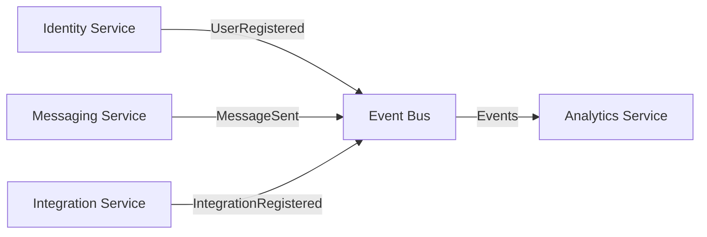

# Domain Model Documentation

## Overview

Meridian follows **Domain Driven Design (DDD)** principles with clearly defined bounded contexts for each microservice. Each service contains its own domain model with aggregates, entities, value objects, and domain events.

## Domain Structure

### Core DDD Concepts

- **Aggregate Root**: The main entity that controls access to its children and maintains consistency
- **Entity**: Objects with identity that can change over time
- **Value Object**: Immutable objects defined by their attributes
- **Domain Events**: Events that represent something important that happened in the domain
- **Commands**: Intent to perform a specific action
- **Queries**: Request for information from the domain
- **Bounded Context**: Clear boundaries between different domain models

---

## Identity Service Domain

### Bounded Context: Identity Management

The Identity service manages user authentication, authorization, and user profile information.

### Aggregate Root: User

The `User` aggregate is the main entry point for all identity-related operations.

```go
type User struct {
    ID               UserID
    Username         Username
    FirstName        string
    LastName         string
    Email            UserEmail
    PasswordHash     PasswordHash
    Version          int64
    RegistrationTime time.Time
    RefreshTokens    []*RefreshToken
}
```

### Value Objects

| Value Object   | Purpose                 | Validation Rules                   |
| -------------- | ----------------------- | ---------------------------------- |
| `UserID`       | Unique user identifier  | UUID v7 format                     |
| `Username`     | User's display name     | 3-30 characters, alphanumeric only |
| `UserEmail`    | User's email address    | Valid email format, unique         |
| `PasswordHash` | Secure password storage | Bcrypt hashing with cost 12        |

### Entities

- **RefreshToken**: Manages authentication token lifecycle with device tracking and expiration

### Domain Events

- `UserRegistered` - User account created
- `UserAuthenticated` - User successfully logged in
- `UserProfileUpdated` - User profile information changed
- `UserDeleted` - User account removed

### Commands

- `RegisterUser` - Create new user account
- `AuthenticateUser` - User login
- `UpdateUserProfile` - Modify user information
- `UpdateUserPassword` - Change user password
- `DeleteUser` - Remove user account
- `RefreshToken` - Refresh authentication token

---

## Messaging Service Domain

### Bounded Context: Real-time Communication

The Messaging service handles real-time messaging, channel management, and WebSocket connections.

### Aggregate Root: Channel

The `Channel` aggregate manages chat rooms and all related messaging activities.

```go
type Channel struct {
    ID              uuid.UUID
    Name            string
    Topic           string
    CreationTime    time.Time
    CreatorUserID   uuid.UUID
    Members         []Member
    Messages        []Message
    Invites         []ChannelInvite
    LastMessageTime time.Time
    IsArchived      bool
    Version         int64
}
```

### Entities

| Entity          | Purpose                   | Key Properties                        |
| --------------- | ------------------------- | ------------------------------------- |
| `Message`       | Individual chat messages  | Content, sender, timestamp, reactions |
| `Member`        | Channel membership        | User ID, role, join date              |
| `ChannelInvite` | Channel invitation system | Invite code, expiration, usage limits |
| `Reaction`      | Message reactions         | User ID, reaction type, timestamp     |

### Value Objects

- **MessageContent**: Structured message content with type and text
- **User**: Read-only user representation from Identity service

### Domain Events

- `ChannelCreated` - New channel created
- `UserJoinedChannel` - User joined channel
- `MessageSent` - Message posted to channel
- `ReactionAdded` - Reaction added to message
- `ChannelArchived` - Channel archived
- `ChannelInviteCreated` - Invitation created

### Commands

- `CreateChannel` - Create new channel
- `JoinChannel` - Join existing channel
- `SendMessage` - Send message to channel
- `AddReaction` - React to message
- `ArchiveChannel` - Archive channel

---

## Integration Service Domain

### Bounded Context: Third-party Integrations

The Integration service manages third-party service connections and API tokens.

### Aggregate Root: Integration

The `Integration` aggregate manages third-party service connections and API tokens.

```go
type Integration struct {
    ID               IntegrationID
    ServiceName      string
    CreatorUserID    UserIDRef
    HashedAPIToken   APIToken
    TokenLookupHash  string
    CreatedAt        time.Time
    IsRevoked        bool
    TargetChannelIDs []ChannelIDRef
    Version          int64
}
```

### Value Objects

| Value Object    | Purpose                                     | Implementation                  |
| --------------- | ------------------------------------------- | ------------------------------- |
| `IntegrationID` | Unique integration identifier               | UUID v7 format                  |
| `APIToken`      | Secure API token storage                    | Hashed with lookup optimization |
| `UserIDRef`     | Reference to user from Identity service     | String UUID reference           |
| `ChannelIDRef`  | Reference to channel from Messaging service | String UUID reference           |

### Domain Events

- `IntegrationRegistered` - New integration created
- `APITokenRevoked` - Token revoked
- `APITokenUpvoked` - Token reactivated
- `IntegrationTargetChannelsUpdated` - Target channels modified

### Commands

- `RegisterIntegration` - Register new integration
- `RevokeToken` - Revoke API token
- `UpvokeIntegration` - Reactivate integration
- `UpdateIntegration` - Update integration settings

---

## Analytics Service Domain

### Bounded Context: Data Analytics

The Analytics service collects, processes, and provides insights about platform usage.

### Aggregate Root: Analytics

The `Analytics` aggregate coordinates all metrics collection and processing.

```go
type Analytics struct {
    ID      AnalyticsID
    Metrics []*AnalyticsMetric
    Version int64
}
```

### Entities

| Entity            | Purpose                       | Properties                        |
| ----------------- | ----------------------------- | --------------------------------- |
| `AnalyticsMetric` | Individual metric measurement | Name, value, timestamp, metadata  |
| `DailyMetric`     | Daily aggregated metrics      | Date, aggregated value, count     |
| `HourlyMetric`    | Hourly aggregated metrics     | Hour, aggregated value, count     |
| `UserActivity`    | User engagement tracking      | User ID, activity type, timestamp |
| `ChannelActivity` | Channel usage metrics         | Channel ID, activity metrics      |

### Value Objects

- **AnalyticsID**: Unique analytics aggregate identifier
- **MetricID**: Unique metric identifier

### Data Transfer Objects

- **DashboardData**: Complete dashboard metrics overview
- **UserGrowthData**: User growth over time
- **MessageVolumeData**: Message volume analytics
- **ChannelActivityData**: Channel activity metrics
- **TopUserData**: Most active users
- **ReactionUsageData**: Reaction usage statistics

### Domain Events

- `MetricTracked` - New metric recorded
- `AnalyticsAggregated` - Metrics aggregated for reporting

### Commands & Queries

- `TrackMetric` - Record new metric
- `GetDashboardData` - Retrieve dashboard data
- `GetUserGrowth` - Get user growth analytics
- `GetMessageVolume` - Get message volume data
- `GetChannelActivity` - Get channel activity metrics

---

## Cross-Service Communication

### Event-Driven Architecture

Services communicate through domain events published to Apache Kafka:



### Service Dependencies

- **Identity ← All Services**: User validation and authentication
- **Messaging ← Integration**: Message sending for webhooks/bots
- **Analytics ← All Services**: Event consumption for metrics
- **All Services**: Cross-cutting concerns via shared packages

### Bounded Contexts

Each service maintains its own bounded context with clear boundaries:

1. **Identity Context**: User management and authentication
2. **Messaging Context**: Real-time communication and channels
3. **Integration Context**: Third-party service connections
4. **Analytics Context**: Data collection and insights

This separation ensures loose coupling while maintaining data consistency through eventual consistency patterns and event sourcing.
