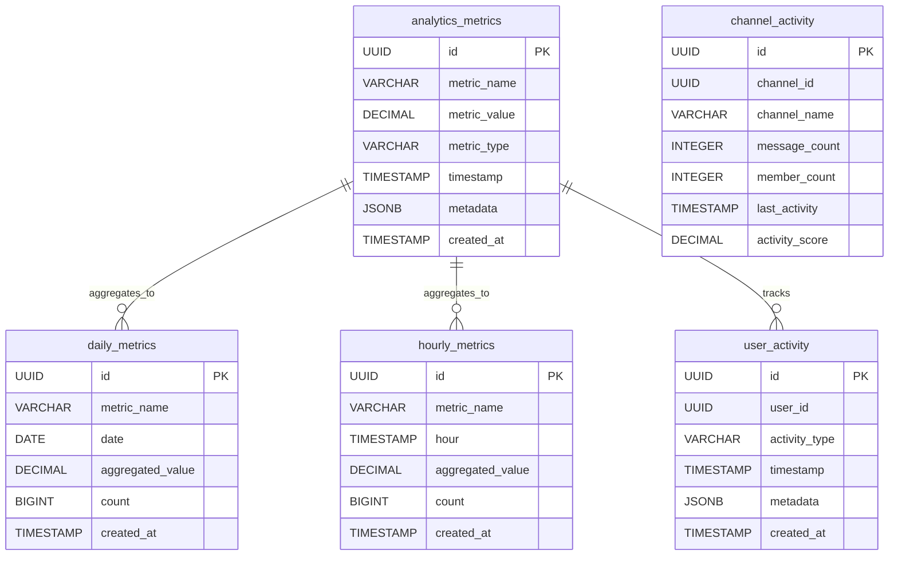

# Analytics Service Documentation

## Overview

The Analytics Service collects, processes, and provides insights about platform usage. It consumes events from all other services and generates comprehensive analytics dashboards and reports.

## Domain Model

### Bounded Context: Data Analytics

The Analytics service manages data collection, processing, and insights within its own bounded context.

### Aggregate Root: Analytics

The `Analytics` aggregate coordinates all metrics collection and processing. It encapsulates analytics data and behavior, ensuring consistency and business rules.

```go
type Analytics struct {
    ID      AnalyticsID
    Metrics []*AnalyticsMetric
    Version int64
}
```

### Entities

| Entity            | Purpose                       | Properties                        |
| ----------------- | ----------------------------- | --------------------------------- |
| `AnalyticsMetric` | Individual metric measurement | Name, value, timestamp, metadata  |
| `DailyMetric`     | Daily aggregated metrics      | Date, aggregated value, count     |
| `HourlyMetric`    | Hourly aggregated metrics     | Hour, aggregated value, count     |
| `UserActivity`    | User engagement tracking      | User ID, activity type, timestamp |
| `ChannelActivity` | Channel usage metrics         | Channel ID, activity metrics      |

### Value Objects

- **AnalyticsID**: Unique analytics aggregate identifier
- **MetricID**: Unique metric identifier

### Data Transfer Objects

- **DashboardData**: Complete dashboard metrics overview
- **UserGrowthData**: User growth over time
- **MessageVolumeData**: Message volume analytics
- **ChannelActivityData**: Channel activity metrics
- **TopUserData**: Most active users
- **ReactionUsageData**: Reaction usage statistics

### Domain Events

- `MetricTracked` - New metric recorded
- `AnalyticsAggregated` - Metrics aggregated for reporting

### Commands & Queries

- `TrackMetric` - Record new metric
- `GetDashboardData` - Retrieve dashboard data
- `GetUserGrowth` - Get user growth analytics
- `GetMessageVolume` - Get message volume data
- `GetChannelActivity` - Get channel activity metrics

## API Reference

### REST API Endpoints

Base URL: `/api/v1/analytics`

**Note**: All analytics endpoints require admin authentication.

#### Dashboard Analytics

| Method | Endpoint            | Description              | Auth Required |
| ------ | ------------------- | ------------------------ | ------------- |
| GET    | `/dashboard`        | Get dashboard overview   | Admin         |
| GET    | `/user-growth`      | Get user growth data     | Admin         |
| GET    | `/message-volume`   | Get message volume data  | Admin         |
| GET    | `/channel-activity` | Get channel activity     | Admin         |
| GET    | `/top-users`        | Get most active users    | Admin         |
| GET    | `/reaction-usage`   | Get reaction usage stats | Admin         |

### Request/Response Examples

#### Get Dashboard Data

```http
GET /api/v1/analytics/dashboard?timeRange=7d
Authorization: Bearer <admin-token>
```

**Response (200):**

```json
{
  "total_users": 1250,
  "active_users": 450,
  "new_users_today": 15,
  "messages_today": 2847,
  "total_channels": 85,
  "active_channels": 42,
  "average_messages_per_user": 6.3,
  "peak_hour": 14,
  "last_updated": "2024-01-15T17:30:00Z"
}
```

#### Get User Growth

```http
GET /api/v1/analytics/user-growth?startDate=2024-01-01&endDate=2024-01-15&interval=daily
Authorization: Bearer <admin-token>
```

**Response (200):**

```json
[
  {
    "period": "2024-01-01",
    "new_users": 25,
    "total_users": 1200,
    "growth_rate": 2.13
  },
  {
    "period": "2024-01-02",
    "new_users": 18,
    "total_users": 1218,
    "growth_rate": 1.5
  }
]
```

#### Get Message Volume

```http
GET /api/v1/analytics/message-volume?startDate=2024-01-01&endDate=2024-01-15&interval=hourly
Authorization: Bearer <admin-token>
```

**Response (200):**

```json
[
  {
    "period": "2024-01-15T10:00:00Z",
    "messages": 125,
    "reactions": 45,
    "channels_active": 23
  },
  {
    "period": "2024-01-15T11:00:00Z",
    "messages": 189,
    "reactions": 67,
    "channels_active": 28
  }
]
```

#### Get Channel Activity

```http
GET /api/v1/analytics/channel-activity?limit=10
Authorization: Bearer <admin-token>
```

**Response (200):**

```json
[
  {
    "channelId": "11234567-89ab-cdef-0123-456789abcdef",
    "channelName": "general",
    "messageCount": 456,
    "memberCount": 15,
    "lastActivity": "2024-01-15T10:30:00Z",
    "activityScore": 0.85
  },
  {
    "channelId": "21234567-89ab-cdef-0123-456789abcdef",
    "channelName": "development",
    "messageCount": 234,
    "memberCount": 8,
    "lastActivity": "2024-01-15T09:45:00Z",
    "activityScore": 0.72
  }
]
```

#### Get Top Users

```http
GET /api/v1/analytics/top-users?limit=10&period=7d
Authorization: Bearer <admin-token>
```

**Response (200):**

```json
[
  {
    "userId": "01234567-89ab-cdef-0123-456789abcdef",
    "username": "johndoe",
    "messageCount": 45,
    "reactionCount": 12,
    "channelsJoined": 5,
    "lastActivity": "2024-01-15T10:30:00Z"
  },
  {
    "userId": "11234567-89ab-cdef-0123-456789abcdef",
    "username": "janedoe",
    "messageCount": 38,
    "reactionCount": 8,
    "channelsJoined": 4,
    "lastActivity": "2024-01-15T09:15:00Z"
  }
]
```

#### Get Reaction Usage

```http
GET /api/v1/analytics/reaction-usage?period=30d
Authorization: Bearer <admin-token>
```

**Response (200):**

```json
[
  {
    "reactionType": "👍",
    "usageCount": 1250,
    "percentage": 45.2
  },
  {
    "reactionType": "❤️",
    "usageCount": 890,
    "percentage": 32.1
  },
  {
    "reactionType": "😂",
    "usageCount": 456,
    "percentage": 16.5
  }
]
```

## Event Consumption

### Kafka Topics

The Analytics service consumes events from the following Kafka topics:

- `meridian.identity.events` - User registration, authentication events
- `meridian.messaging.events` - Message sent, channel activity events
- `meridian.integration.events` - Integration registration, webhook events

### Event Processing

#### UserRegistered Event

```json
{
  "eventType": "UserRegistered",
  "aggregateId": "01234567-89ab-cdef-0123-456789abcdef",
  "version": 1,
  "userId": "01234567-89ab-cdef-0123-456789abcdef",
  "username": "johndoe",
  "timestamp": "2024-01-15T10:30:00Z"
}
```

**Processing:**

1. Increment total users count
2. Record new user registration
3. Update daily user growth metrics
4. Trigger real-time dashboard updates

#### MessageSent Event

```json
{
  "eventType": "MessageSent",
  "aggregateId": "11234567-89ab-cdef-0123-456789abcdef",
  "version": 2,
  "messageID": "31234567-89ab-cdef-0123-456789abcdef",
  "senderUserID": "01234567-89ab-cdef-0123-456789abcdef",
  "channelID": "11234567-89ab-cdef-0123-456789abcdef",
  "timestamp": "2024-01-15T14:30:00Z"
}
```

**Processing:**

1. Increment message count metrics
2. Update channel activity data
3. Track user engagement
4. Calculate message volume trends

## Domain Logic

### Metric Collection

1. Consume events from Kafka topics
2. Parse and validate event data
3. Create metric records with timestamps
4. Store in appropriate aggregation tables
5. Trigger real-time updates

### Data Aggregation

- **Hourly**: Aggregate metrics by hour for trend analysis
- **Daily**: Aggregate metrics by day for reporting
- **Real-time**: Maintain current period metrics for dashboard

### Performance Optimization

- **Caching**: Redis for frequently accessed metrics
- **Batch Processing**: Process events in batches for efficiency
- **Indexing**: Optimized database indexes for query performance

## Infrastructure

### Technology Stack

- **Language**: Go 1.24+
- **Framework**: Gin (HTTP)
- **Database**: PostgreSQL
- **Message Queue**: Apache Kafka
- **Cache**: Redis (for dashboard caching)

### Ports

- **HTTP**: 8083

### Configuration

#### Environment Variables

| Variable                   | Description                  | Default             | Required |
| -------------------------- | ---------------------------- | ------------------- | -------- |
| `ANALYTICS_HTTP_PORT`      | HTTP server port             | `:8083`             | Yes      |
| `ANALYTICS_DB_URL`         | PostgreSQL connection string | -                   | Yes      |
| `ANALYTICS_KAFKA_BROKERS`  | Kafka broker addresses       | -                   | Yes      |
| `ANALYTICS_CONSUMER_GROUP` | Kafka consumer group         | `analytics-service` | Yes      |

### Database Schema

#### Entity Relationship Diagram



#### Analytics Metrics Table

```sql
CREATE TABLE analytics_metrics (
    id UUID PRIMARY KEY,
    metric_name VARCHAR(100) NOT NULL,
    metric_value DECIMAL(15,2) NOT NULL,
    metric_type VARCHAR(50) NOT NULL,
    timestamp TIMESTAMP WITH TIME ZONE NOT NULL,
    metadata JSONB,
    created_at TIMESTAMP WITH TIME ZONE DEFAULT NOW()
);
```

#### Daily Metrics Table

```sql
CREATE TABLE daily_metrics (
    id UUID PRIMARY KEY,
    metric_name VARCHAR(100) NOT NULL,
    date DATE NOT NULL,
    aggregated_value DECIMAL(15,2) NOT NULL,
    count BIGINT NOT NULL DEFAULT 0,
    created_at TIMESTAMP WITH TIME ZONE DEFAULT NOW(),

    UNIQUE(metric_name, date)
);
```

#### Hourly Metrics Table

```sql
CREATE TABLE hourly_metrics (
    id UUID PRIMARY KEY,
    metric_name VARCHAR(100) NOT NULL,
    hour TIMESTAMP WITH TIME ZONE NOT NULL,
    aggregated_value DECIMAL(15,2) NOT NULL,
    count BIGINT NOT NULL DEFAULT 0,
    created_at TIMESTAMP WITH TIME ZONE DEFAULT NOW(),

    UNIQUE(metric_name, hour)
);
```

#### User Activity Table

```sql
CREATE TABLE user_activity (
    id UUID PRIMARY KEY,
    user_id UUID NOT NULL,
    activity_type VARCHAR(50) NOT NULL,
    timestamp TIMESTAMP WITH TIME ZONE NOT NULL,
    metadata JSONB,
    created_at TIMESTAMP WITH TIME ZONE DEFAULT NOW()
);
```

## Error Handling

### Common Error Codes

| Code                  | Description                    | HTTP Status |
| --------------------- | ------------------------------ | ----------- |
| `ErrUnauthorized`     | Admin authentication required  | 401         |
| `ErrForbidden`        | Insufficient permissions       | 403         |
| `ErrInvalidDateRange` | Invalid date range parameters  | 400         |
| `ErrMetricNotFound`   | Requested metric not available | 404         |

### Error Response Format

```json
{
  "error": "Admin authentication required"
}
```

## Monitoring & Health Checks

### Health Endpoint

```http
GET /health
```

Response:

```json
{
  "status": "healthy",
  "service": "analytics"
}
```

### Metrics

- Event processing throughput
- Database query performance
- Cache hit rates
- Dashboard response times
- Error rates by endpoint
