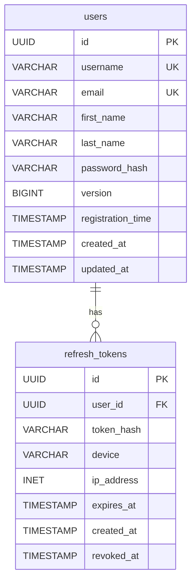

# Identity Service Documentation

## Overview

The Identity Service is responsible for user authentication, authorization, and user profile management across the entire Meridian platform. It serves as the central authority for user identity and provides secure token-based authentication using PASETO tokens.

## Domain Model

### Bounded Context: Identity Management

The Identity service manages user authentication, authorization, and user profile information within its own bounded context.

### Aggregate Root: User

The `User` aggregate is the main entry point for all identity-related operations. It encapsulates user data and behavior, ensuring consistency and business rules.

```go
type User struct {
    ID               UserID
    Username         Username
    FirstName        string
    LastName         string
    Email            UserEmail
    PasswordHash     PasswordHash
    Version          int64
    RegistrationTime time.Time
    RefreshTokens    []*RefreshToken
}
```

### Value Objects

| Value Object   | Purpose                 | Validation Rules                   |
| -------------- | ----------------------- | ---------------------------------- |
| `UserID`       | Unique user identifier  | UUID v7 format                     |
| `Username`     | User's display name     | 3-30 characters, alphanumeric only |
| `UserEmail`    | User's email address    | Valid email format, unique         |
| `PasswordHash` | Secure password storage | Bcrypt hashing with cost 12        |

### Entities

- **RefreshToken**: Manages authentication token lifecycle with device tracking and expiration

### Domain Events

- `UserRegistered` - User account created
- `UserAuthenticated` - User successfully logged in
- `UserProfileUpdated` - User profile information changed
- `UserDeleted` - User account removed

### Commands

- `RegisterUser` - Create new user account
- `AuthenticateUser` - User login
- `UpdateUserProfile` - Modify user information
- `UpdateUserPassword` - Change user password
- `DeleteUser` - Remove user account
- `RefreshToken` - Refresh authentication token

## API Reference

### REST API Endpoints

Base URL: `/api/v1/auth`

#### Authentication Endpoints

| Method | Endpoint          | Description                   | Auth Required |
| ------ | ----------------- | ----------------------------- | ------------- |
| POST   | `/register`       | Register a new user           | No            |
| POST   | `/login`          | Authenticate user             | No            |
| GET    | `/validate-token` | Validate authentication token | No            |
| POST   | `/refresh-token`  | Refresh authentication token  | No            |

#### User Profile Endpoints

| Method | Endpoint             | Description              | Auth Required |
| ------ | -------------------- | ------------------------ | ------------- |
| GET    | `/me`                | Get current user profile | Yes           |
| PUT    | `/me/update-profile` | Update user profile      | Yes           |
| PUT    | `/me/password`       | Change user password     | Yes           |
| DELETE | `/me`                | Delete user account      | Yes           |

### Request/Response Examples

#### User Registration

```http
POST /api/v1/auth/register
Content-Type: application/json

{
  "username": "johndoe",
  "email": "john@example.com",
  "firstName": "John",
  "lastName": "Doe",
  "password": "SecurePassword123!"
}
```

**Response (200):**

```json
{
  "id": "01234567-89ab-cdef-0123-456789abcdef",
  "username": "johndoe",
  "email": "john@example.com",
  "firstName": "John",
  "lastName": "Doe",
  "isAdmin": false
}
```

#### User Authentication

```http
POST /api/v1/auth/login
Content-Type: application/json

{
  "login": "johndoe",
  "password": "SecurePassword123!"
}
```

**Response (200):**

```json
{
  "user": {
    "id": "01234567-89ab-cdef-0123-456789abcdef",
    "username": "johndoe",
    "email": "john@example.com",
    "firstName": "John",
    "lastName": "Doe",
    "isAdmin": false
  },
  "tokens": {
    "accessToken": "v4.local.xxx...",
    "refreshToken": "v4.local.yyy...",
    "tokenType": "bearer",
    "expiresIn": 3600
  }
}
```

#### Get Current User

```http
GET /api/v1/auth/me
Authorization: Bearer v4.local.xxx...
```

**Response (200):**

```json
{
  "id": "01234567-89ab-cdef-0123-456789abcdef",
  "username": "johndoe",
  "email": "john@example.com",
  "firstName": "John",
  "lastName": "Doe",
  "isAdmin": false
}
```

#### Update User Profile

```http
PUT /api/v1/auth/me/update-profile
Authorization: Bearer v4.local.xxx...
Content-Type: application/json

{
  "email": "newemail@example.com",
  "firstName": "Johnny",
  "lastName": "Doe"
}
```

**Response (200):**

```json
{
  "id": "01234567-89ab-cdef-0123-456789abcdef",
  "username": "johndoe",
  "email": "newemail@example.com",
  "firstName": "Johnny",
  "lastName": "Doe",
  "isAdmin": false
}
```

#### Change Password

```http
PUT /api/v1/auth/me/password
Authorization: Bearer v4.local.xxx...
Content-Type: application/json

{
  "newPassword": "NewSecurePassword456!"
}
```

**Response (202):** No content

#### Refresh Token

```http
POST /api/v1/auth/refresh-token
Content-Type: application/json

{
  "refreshToken": "v4.local.yyy..."
}
```

**Response (200):**

```json
{
  "accessToken": "v4.local.zzz...",
  "refreshToken": "v4.local.aaa...",
  "tokenType": "bearer",
  "expiresIn": 3600
}
```

#### Delete User Account

```http
DELETE /api/v1/auth/me
Authorization: Bearer v4.local.xxx...
```

**Response (202):** No content

### gRPC Services

**Note**: gRPC services are for internal inter-service communication only. External integrations should use HTTP REST APIs.

#### IdentityService

```protobuf
service IdentityService {
  rpc ValidateToken(ValidateTokenRequest) returns (ValidateTokenResponse);
  rpc GetUserByID(GetUserByIDRequest) returns (GetUserByIDResponse);
  rpc GetUsers(GetUsersRequest) returns (GetUsersResponse);
}
```

#### Token Validation

Used by other services to validate user authentication:

```protobuf
message ValidateTokenRequest {
  string token = 1;
}

message ValidateTokenResponse {
  bool valid = 1;
  User user = 2;
  string error = 3;
}
```

## Domain Logic

### User Registration

1. Validate input data (username, email, password)
2. Check for existing username/email
3. Hash password with bcrypt
4. Create User aggregate with domain events
5. Persist to database
6. Publish `UserRegistered` event

### User Authentication

1. Find user by username or email
2. Verify password hash
3. Generate PASETO access and refresh tokens
4. Create domain events
5. Publish `UserAuthenticated` event

### Password Policy

- Minimum 8 characters
- Must contain uppercase, lowercase, number, and special character
- Bcrypt hashing with cost factor 12
- Password history prevention

### Token Management

- **Access Tokens**: PASETO v4.local, 1-hour expiration
- **Refresh Tokens**: PASETO v4.local, 24-hour expiration
- Device and IP tracking for security auditing
- Automatic token rotation on refresh

## Error Handling

### Common Error Codes

| Code                 | Description                        | HTTP Status |
| -------------------- | ---------------------------------- | ----------- |
| `ErrUsernameTaken`   | Username already exists            | 409         |
| `ErrEmailTaken`      | Email already registered           | 409         |
| `ErrPasswordPolicy`  | Password doesn't meet requirements | 400         |
| `ErrAuthFailed`      | Invalid credentials                | 401         |
| `ErrUserNotFound`    | User doesn't exist                 | 404         |
| `ErrUsernameInvalid` | Invalid username format            | 400         |
| `ErrEmailInvalid`    | Invalid email format               | 400         |

### Error Response Format

```json
{
  "error": "Username is already taken"
}
```

## Events

### Published Events

#### UserRegisteredEvent

```json
{
  "eventType": "UserRegistered",
  "aggregateId": "01234567-89ab-cdef-0123-456789abcdef",
  "version": 1,
  "userId": "01234567-89ab-cdef-0123-456789abcdef",
  "username": "johndoe",
  "email": "john@example.com",
  "firstName": "John",
  "lastName": "Doe",
  "timestamp": "2024-01-15T10:30:00Z"
}
```

#### UserAuthenticatedEvent

```json
{
  "eventType": "UserAuthenticated",
  "aggregateId": "01234567-89ab-cdef-0123-456789abcdef",
  "version": 2,
  "userId": "01234567-89ab-cdef-0123-456789abcdef",
  "username": "johndoe",
  "authenticationToken": "v4.local.xxx...",
  "timestamp": "2024-01-15T10:35:00Z"
}
```

## Infrastructure

### Technology Stack

- **Language**: Go 1.24+
- **Framework**: Gin (HTTP), gRPC (Inter-service)
- **Database**: PostgreSQL
- **Cache**: Redis
- **Authentication**: PASETO tokens
- **Message Queue**: Apache Kafka

### Ports

- **HTTP**: 8080
- **gRPC**: 9090

### Configuration

#### Environment Variables

| Variable                         | Description                        | Default | Required |
| -------------------------------- | ---------------------------------- | ------- | -------- |
| `IDENTITY_HTTP_PORT`             | HTTP server port                   | `:8080` | Yes      |
| `IDENTITY_GRPC_PORT`             | gRPC server port                   | `9090`  | Yes      |
| `IDENTITY_DB_URL`                | PostgreSQL connection string       | -       | Yes      |
| `IDENTITY_REDIS_URL`             | Redis connection string            | -       | Yes      |
| `IDENTITY_KAFKA_BROKERS`         | Kafka broker addresses             | -       | Yes      |
| `IDENTITY_PASETO_PRIVATE_KEY`    | PASETO private key for signing     | -       | Yes      |
| `IDENTITY_PASETO_PUBLIC_KEY`     | PASETO public key for verification | -       | Yes      |
| `AUTH_TOKEN_VALIDITY_MINUTES`    | Access token expiration            | `60`    | No       |
| `REFRESH_TOKEN_VALIDITY_MINUTES` | Refresh token expiration           | `1440`  | No       |

### Database Schema

#### Entity Relationship Diagram



#### Users Table

```sql
CREATE TABLE users (
    id UUID PRIMARY KEY,
    username VARCHAR(50) UNIQUE NOT NULL,
    email VARCHAR(255) UNIQUE NOT NULL,
    first_name VARCHAR(100) NOT NULL,
    last_name VARCHAR(100) NOT NULL,
    password_hash VARCHAR(255) NOT NULL,
    version BIGINT NOT NULL DEFAULT 1,
    registration_time TIMESTAMP WITH TIME ZONE NOT NULL,
    created_at TIMESTAMP WITH TIME ZONE DEFAULT NOW(),
    updated_at TIMESTAMP WITH TIME ZONE DEFAULT NOW()
);
```

#### Refresh Tokens Table

```sql
CREATE TABLE refresh_tokens (
    id UUID PRIMARY KEY,
    user_id UUID NOT NULL REFERENCES users(id) ON DELETE CASCADE,
    token_hash VARCHAR(255) NOT NULL,
    device VARCHAR(255),
    ip_address INET,
    expires_at TIMESTAMP WITH TIME ZONE NOT NULL,
    created_at TIMESTAMP WITH TIME ZONE DEFAULT NOW(),
    revoked_at TIMESTAMP WITH TIME ZONE
);
```

## Monitoring & Health Checks

### Health Endpoint

```http
GET /health
```

Response:

```json
{
  "status": "healthy",
  "service": "identity"
}
```

### Metrics Endpoint

```http
GET /metrics
```

Response:

```json
{
  "hits": 1250,
  "misses": 75,
  "hit_rate": 0.943
}
```
