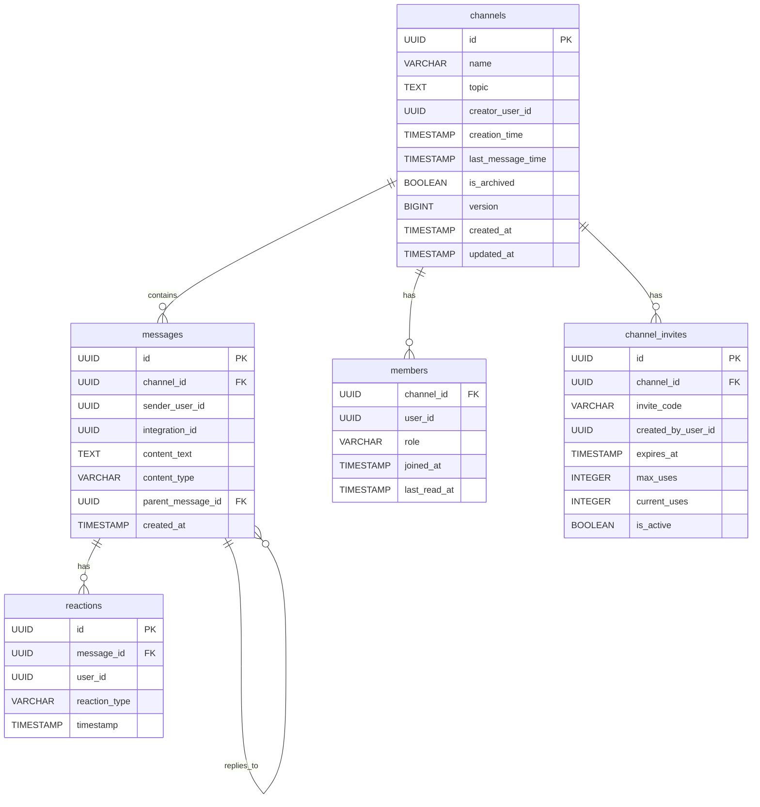

# Messaging Service Documentation

## Overview

The Messaging Service handles real-time communication, channel management, and WebSocket connections for live chat functionality. It supports both traditional messaging and integration-based messaging through webhooks and bots.

## Domain Model

### Bounded Context: Real-time Communication

The Messaging service manages real-time messaging, channel management, and WebSocket connections within its own bounded context.

### Aggregate Root: Channel

The `Channel` aggregate manages chat rooms and all related messaging activities. It encapsulates channel data and behavior, ensuring consistency and business rules.

```go
type Channel struct {
    ID              uuid.UUID
    Name            string
    Topic           string
    CreationTime    time.Time
    CreatorUserID   uuid.UUID
    Members         []Member
    Messages        []Message
    Invites         []ChannelInvite
    LastMessageTime time.Time
    IsArchived      bool
    Version         int64
}
```

### Entities

| Entity          | Purpose                   | Key Properties                        |
| --------------- | ------------------------- | ------------------------------------- |
| `Message`       | Individual chat messages  | Content, sender, timestamp, reactions |
| `Member`        | Channel membership        | User ID, role, join date              |
| `ChannelInvite` | Channel invitation system | Invite code, expiration, usage limits |
| `Reaction`      | Message reactions         | User ID, reaction type, timestamp     |

### Value Objects

- **MessageContent**: Structured message content with type and text
- **User**: Read-only user representation from Identity service

### Domain Events

- `ChannelCreated` - New channel created
- `UserJoinedChannel` - User joined channel
- `MessageSent` - Message posted to channel
- `ReactionAdded` - Reaction added to message
- `ChannelArchived` - Channel archived
- `ChannelInviteCreated` - Invitation created

### Commands

- `CreateChannel` - Create new channel
- `JoinChannel` - Join existing channel
- `SendMessage` - Send message to channel
- `AddReaction` - React to message
- `ArchiveChannel` - Archive channel

## API Reference

### REST API Endpoints

Base URL: `/api/v1/messages`

#### WebSocket Connection

| Method | Endpoint | Description                                  | Auth Required |
| ------ | -------- | -------------------------------------------- | ------------- |
| GET    | `/ws`    | WebSocket connection for real-time messaging | Yes           |

#### Channel Management

| Method | Endpoint                  | Description          | Auth Required |
| ------ | ------------------------- | -------------------- | ------------- |
| GET    | `/channels/`              | Get user's channels  | Yes           |
| POST   | `/channels/`              | Create a new channel | Yes           |
| GET    | `/channels/:id`           | Get channel details  | Yes           |
| POST   | `/channels/:id/join`      | Join a channel       | Yes           |
| PUT    | `/channels/:id/archive`   | Archive a channel    | Yes           |
| PUT    | `/channels/:id/unarchive` | Unarchive a channel  | Yes           |
| POST   | `/channels/:id/bots`      | Add bot to channel   | Yes           |

#### Message Operations

| Method | Endpoint                                  | Description             | Auth Required |
| ------ | ----------------------------------------- | ----------------------- | ------------- |
| GET    | `/channels/:id/messages`                  | Get channel messages    | Yes           |
| POST   | `/channels/:id/messages`                  | Send message to channel | Yes           |
| PUT    | `/channels/:id/messages/:msgId/reactions` | Add reaction            | Yes           |
| DELETE | `/channels/:id/messages/:msgId/reactions` | Remove reaction         | Yes           |

#### Invite Management

| Method | Endpoint                | Description               | Auth Required |
| ------ | ----------------------- | ------------------------- | ------------- |
| POST   | `/channels/:id/invites` | Create channel invite     | Yes           |
| GET    | `/channels/:id/invites` | Get channel invites       | Yes           |
| POST   | `/invites/accept`       | Accept channel invite     | Yes           |
| DELETE | `/invites/:id`          | Deactivate channel invite | Yes           |

### Request/Response Examples

#### Get User Channels

```http
GET /api/v1/messages/channels/
Authorization: Bearer v4.local.xxx...
X-User-ID: 01234567-89ab-cdef-0123-456789abcdef
```

**Response (200):**

```json
[
  {
    "id": "11234567-89ab-cdef-0123-456789abcdef",
    "name": "general",
    "topic": "General discussion",
    "creatorUserId": "01234567-89ab-cdef-0123-456789abcdef",
    "creationTime": "2024-01-01T10:00:00Z",
    "lastMessageTime": "2024-01-15T14:30:00Z",
    "memberCount": 25,
    "isArchived": false
  }
]
```

#### Create Channel

```http
POST /api/v1/messages/channels/
Authorization: Bearer v4.local.xxx...
X-User-ID: 01234567-89ab-cdef-0123-456789abcdef
Content-Type: application/json

{
  "name": "development",
  "topic": "Development discussions and updates"
}
```

**Response (201):**

```json
{
  "id": "21234567-89ab-cdef-0123-456789abcdef",
  "name": "development",
  "topic": "Development discussions and updates",
  "creatorUserId": "01234567-89ab-cdef-0123-456789abcdef",
  "creationTime": "2024-01-15T15:00:00Z",
  "lastMessageTime": "2024-01-15T15:00:00Z",
  "memberCount": 1,
  "isArchived": false
}
```

#### Get Channel Details

```http
GET /api/v1/messages/channels/11234567-89ab-cdef-0123-456789abcdef
Authorization: Bearer v4.local.xxx...
X-User-ID: 01234567-89ab-cdef-0123-456789abcdef
```

**Response (200):**

```json
{
  "id": "11234567-89ab-cdef-0123-456789abcdef",
  "name": "general",
  "topic": "General discussion",
  "creatorUserId": "01234567-89ab-cdef-0123-456789abcdef",
  "creationTime": "2024-01-01T10:00:00Z",
  "lastMessageTime": "2024-01-15T14:30:00Z",
  "memberCount": 25,
  "isArchived": false,
  "members": [
    {
      "userId": "01234567-89ab-cdef-0123-456789abcdef",
      "username": "johndoe",
      "role": "owner",
      "joinedAt": "2024-01-01T10:00:00Z"
    }
  ]
}
```

#### Send Message

```http
POST /api/v1/messages/channels/11234567-89ab-cdef-0123-456789abcdef/messages
Authorization: Bearer v4.local.xxx...
X-User-ID: 01234567-89ab-cdef-0123-456789abcdef
Content-Type: application/json

{
  "content_text": "Hello, everyone!",
  "is_integration_message": false,
  "parent_message_id": null
}
```

**Response (201):**

```json
{
  "id": "31234567-89ab-cdef-0123-456789abcdef",
  "channelId": "11234567-89ab-cdef-0123-456789abcdef",
  "senderUserId": "01234567-89ab-cdef-0123-456789abcdef",
  "content": {
    "text": "Hello, everyone!",
    "type": "text"
  },
  "createdAt": "2024-01-15T14:30:00Z",
  "reactions": [],
  "user": {
    "username": "johndoe",
    "firstName": "John",
    "lastName": "Doe"
  }
}
```

#### Get Channel Messages

```http
GET /api/v1/messages/channels/11234567-89ab-cdef-0123-456789abcdef/messages
Authorization: Bearer v4.local.xxx...
X-User-ID: 01234567-89ab-cdef-0123-456789abcdef
```

**Response (200):**

```json
[
  {
    "id": "31234567-89ab-cdef-0123-456789abcdef",
    "channelId": "11234567-89ab-cdef-0123-456789abcdef",
    "senderUserId": "01234567-89ab-cdef-0123-456789abcdef",
    "content": {
      "text": "Hello, everyone!",
      "type": "text"
    },
    "createdAt": "2024-01-15T14:30:00Z",
    "parentMessageId": null,
    "reactions": [
      {
        "id": "41234567-89ab-cdef-0123-456789abcdef",
        "userId": "51234567-89ab-cdef-0123-456789abcdef",
        "reactionType": "👍",
        "timestamp": "2024-01-15T14:31:00Z"
      }
    ],
    "user": {
      "username": "johndoe",
      "firstName": "John",
      "lastName": "Doe"
    }
  }
]
```

#### Add Reaction

```http
PUT /api/v1/messages/channels/11234567-89ab-cdef-0123-456789abcdef/messages/31234567-89ab-cdef-0123-456789abcdef/reactions
Authorization: Bearer v4.local.xxx...
X-User-ID: 01234567-89ab-cdef-0123-456789abcdef
Content-Type: application/json

{
  "user_id": "01234567-89ab-cdef-0123-456789abcdef",
  "reaction_type": "👍"
}
```

**Response (204):** No content

#### Create Channel Invite

```http
POST /api/v1/messages/channels/11234567-89ab-cdef-0123-456789abcdef/invites
Authorization: Bearer v4.local.xxx...
X-User-ID: 01234567-89ab-cdef-0123-456789abcdef
Content-Type: application/json

{
  "expires_at": "2024-01-22T15:00:00Z",
  "max_uses": 10
}
```

**Response (201):**

```json
{
  "id": "61234567-89ab-cdef-0123-456789abcdef",
  "channelId": "11234567-89ab-cdef-0123-456789abcdef",
  "inviteCode": "INVITE123ABC",
  "createdByUserId": "01234567-89ab-cdef-0123-456789abcdef",
  "expiresAt": "2024-01-22T15:00:00Z",
  "maxUses": 10,
  "currentUses": 0,
  "isActive": true
}
```

#### Accept Channel Invite

```http
POST /api/v1/messages/invites/accept
Authorization: Bearer v4.local.xxx...
X-User-ID: 01234567-89ab-cdef-0123-456789abcdef
Content-Type: application/json

{
  "invite_code": "INVITE123ABC"
}
```

**Response (200):**

```json
{
  "channelId": "11234567-89ab-cdef-0123-456789abcdef",
  "channelName": "general",
  "joined": true
}
```

## WebSocket API

**Note**: WebSocket connections are only available to the frontend application for real-time messaging. External integrations should use HTTP REST APIs for sending messages.

### Connection

Connect to `/api/v1/messages/ws` with authentication headers.

### Message Types

#### Join Channel

```json
{
  "type": "join_channel",
  "payload": {
    "channelId": "11234567-89ab-cdef-0123-456789abcdef"
  }
}
```

#### Send Message

```json
{
  "type": "send_message",
  "payload": {
    "channelId": "11234567-89ab-cdef-0123-456789abcdef",
    "content": "Hello from WebSocket!",
    "parentMessageId": null
  }
}
```

#### Typing Indicator

```json
{
  "type": "typing",
  "payload": {
    "channelId": "11234567-89ab-cdef-0123-456789abcdef",
    "isTyping": true
  }
}
```

### Received Events

#### Message Received

```json
{
  "type": "message_received",
  "payload": {
    "id": "31234567-89ab-cdef-0123-456789abcdef",
    "channelId": "11234567-89ab-cdef-0123-456789abcdef",
    "senderUserId": "01234567-89ab-cdef-0123-456789abcdef",
    "content": {
      "text": "Hello from WebSocket!",
      "type": "text"
    },
    "createdAt": "2024-01-15T14:40:00Z",
    "user": {
      "username": "johndoe",
      "firstName": "John",
      "lastName": "Doe"
    }
  }
}
```

#### User Typing

```json
{
  "type": "user_typing",
  "payload": {
    "channelId": "11234567-89ab-cdef-0123-456789abcdef",
    "userId": "01234567-89ab-cdef-0123-456789abcdef",
    "username": "johndoe",
    "isTyping": true
  }
}
```

### gRPC Services

**Note**: gRPC services are for internal inter-service communication only. External integrations should use HTTP REST APIs.

#### MessagingService

```protobuf
service MessagingService {
  rpc SendMessage(SendMessageRequest) returns (SendMessageResponse);
  rpc RegisterBot(RegisterBotRequest) returns (RegisterBotResponse);
}
```

#### Bot Registration

Used by Integration service to register bots in channels:

```protobuf
message RegisterBotRequest {
  string integration_id = 1;
  repeated string channel_ids = 2;
  string requestor_id = 3;
}

message RegisterBotResponse {
  bool success = 1;
  string error = 2;
}
```

## Domain Logic

### Channel Creation

1. Validate channel name and topic
2. Create Channel aggregate with domain events
3. Add creator as owner member
4. Persist to database
5. Publish `ChannelCreated` event

### Message Sending

1. Validate user is channel member
2. Create Message entity
3. Update channel's last message time
4. Create domain events
5. Broadcast via WebSocket
6. Publish `MessageSent` event

### Real-time Features

- WebSocket connection management with automatic reconnection
- Message broadcasting to all channel members
- Typing indicators with automatic timeout
- Message reactions in real-time
- Channel activity notifications

## Events

### Published Events

#### ChannelCreatedEvent

```json
{
  "eventType": "ChannelCreated",
  "aggregateId": "11234567-89ab-cdef-0123-456789abcdef",
  "version": 1,
  "channelName": "general",
  "creatorUserID": "01234567-89ab-cdef-0123-456789abcdef",
  "topic": "General discussion channel"
}
```

#### MessageSentEvent

```json
{
  "eventType": "MessageSent",
  "aggregateId": "11234567-89ab-cdef-0123-456789abcdef",
  "version": 2,
  "messageID": "31234567-89ab-cdef-0123-456789abcdef",
  "senderUserID": "01234567-89ab-cdef-0123-456789abcdef",
  "content": {
    "text": "Hello, everyone!",
    "type": "text"
  },
  "timestamp": "2024-01-15T14:30:00Z"
}
```

#### UserJoinedChannelEvent

```json
{
  "eventType": "UserJoinedChannel",
  "aggregateId": "11234567-89ab-cdef-0123-456789abcdef",
  "version": 3,
  "userID": "41234567-89ab-cdef-0123-456789abcdef",
  "role": "member",
  "joinedAt": "2024-01-15T14:45:00Z"
}
```

## Infrastructure

### Technology Stack

- **Language**: Go 1.24+
- **Framework**: Gin (HTTP), WebSocket (Real-time), gRPC (Inter-service)
- **Database**: PostgreSQL
- **Cache**: Redis
- **Message Queue**: Apache Kafka
- **Real-time**: WebSocket connections with automatic reconnection

### Ports

- **HTTP**: 8081
- **gRPC**: 9091
- **WebSocket**: Available at `/api/v1/messages/ws`

### Configuration

#### Environment Variables

| Variable                  | Description                  | Default | Required |
| ------------------------- | ---------------------------- | ------- | -------- |
| `MESSAGING_HTTP_PORT`     | HTTP server port             | `:8081` | Yes      |
| `MESSAGING_GRPC_PORT`     | gRPC server port             | `9091`  | Yes      |
| `MESSAGING_DB_URL`        | PostgreSQL connection string | -       | Yes      |
| `MESSAGING_REDIS_URL`     | Redis connection string      | -       | Yes      |
| `MESSAGING_KAFKA_BROKERS` | Kafka broker addresses       | -       | Yes      |
| `IDENTITY_GRPC_URL`       | Identity service gRPC URL    | -       | Yes      |
| `INTEGRATION_GRPC_URL`    | Integration service gRPC URL | -       | Yes      |

### Database Schema

#### Entity Relationship Diagram



#### Channels Table

```sql
CREATE TABLE channels (
    id UUID PRIMARY KEY,
    name VARCHAR(100) NOT NULL,
    topic TEXT,
    creator_user_id UUID NOT NULL,
    creation_time TIMESTAMP WITH TIME ZONE NOT NULL,
    last_message_time TIMESTAMP WITH TIME ZONE NOT NULL,
    is_archived BOOLEAN NOT NULL DEFAULT FALSE,
    version BIGINT NOT NULL DEFAULT 1,
    created_at TIMESTAMP WITH TIME ZONE DEFAULT NOW(),
    updated_at TIMESTAMP WITH TIME ZONE DEFAULT NOW()
);
```

#### Messages Table

```sql
CREATE TABLE messages (
    id UUID PRIMARY KEY,
    channel_id UUID NOT NULL REFERENCES channels(id) ON DELETE CASCADE,
    sender_user_id UUID,
    integration_id UUID,
    content_text TEXT NOT NULL,
    content_type VARCHAR(50) NOT NULL DEFAULT 'text',
    parent_message_id UUID REFERENCES messages(id),
    created_at TIMESTAMP WITH TIME ZONE DEFAULT NOW(),

    CONSTRAINT check_sender_or_integration
        CHECK ((sender_user_id IS NOT NULL) OR (integration_id IS NOT NULL))
);
```

#### Members Table

```sql
CREATE TABLE members (
    channel_id UUID NOT NULL REFERENCES channels(id) ON DELETE CASCADE,
    user_id UUID NOT NULL,
    role VARCHAR(50) NOT NULL DEFAULT 'member',
    joined_at TIMESTAMP WITH TIME ZONE DEFAULT NOW(),
    last_read_at TIMESTAMP WITH TIME ZONE DEFAULT NOW(),

    PRIMARY KEY (channel_id, user_id)
);
```

## Error Handling

### Common Error Codes

| Code                    | Description                    | HTTP Status |
| ----------------------- | ------------------------------ | ----------- |
| `ErrChannelNotFound`    | Channel doesn't exist          | 404         |
| `ErrUnauthorized`       | User not authenticated         | 401         |
| `ErrForbidden`          | User lacks permission          | 403         |
| `ErrInvalidChannelName` | Invalid channel name format    | 400         |
| `ErrUserNotMember`      | User not a channel member      | 403         |
| `ErrChannelArchived`    | Cannot modify archived channel | 400         |
| `ErrInviteExpired`      | Invitation has expired         | 400         |

## Monitoring & Health Checks

### Health Endpoint

```http
GET /health
```

Response:

```json
{
  "status": "healthy",
  "service": "messaging"
}
```

### Metrics

- Active WebSocket connections
- Messages per second
- Channel activity rates
- Redis cache hit rates
- Database query performance
